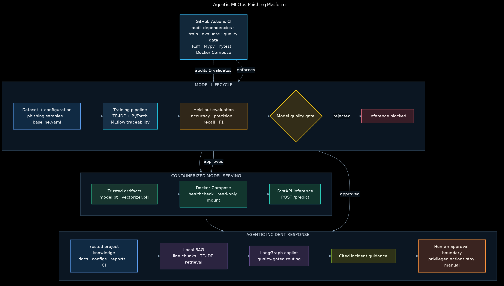
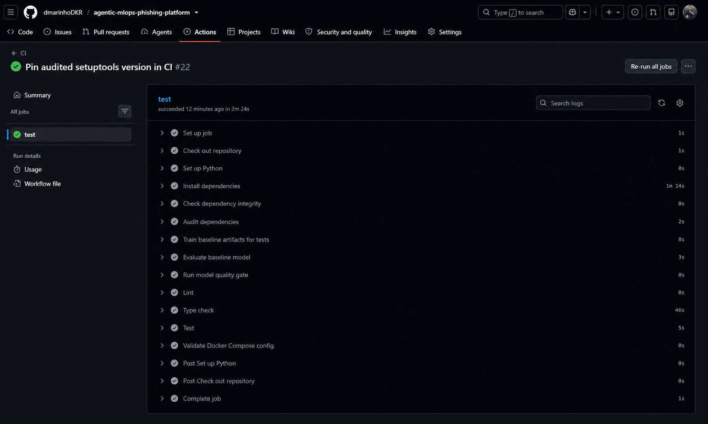
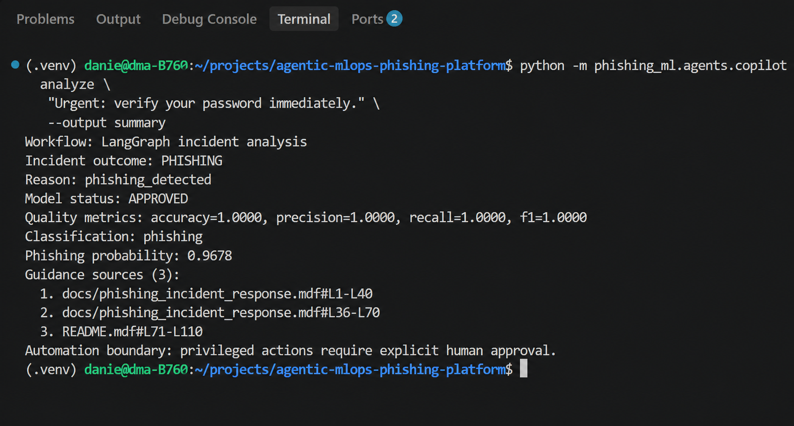
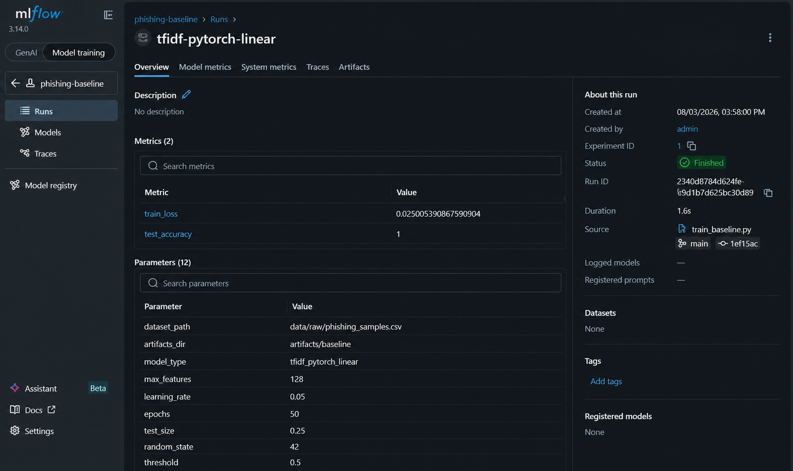
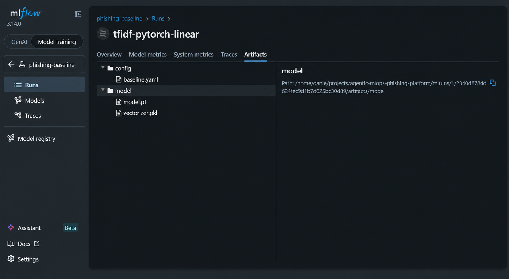
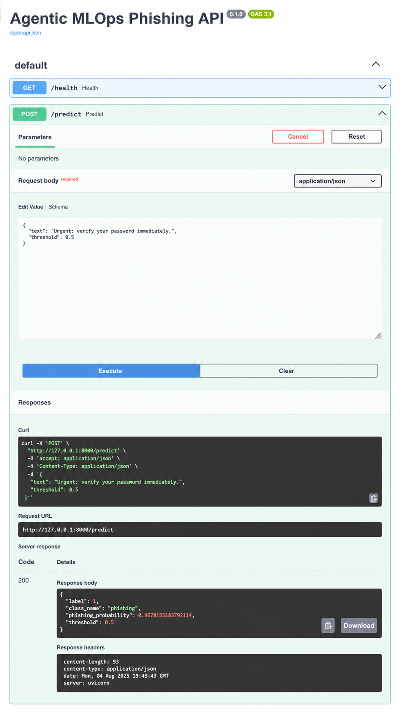
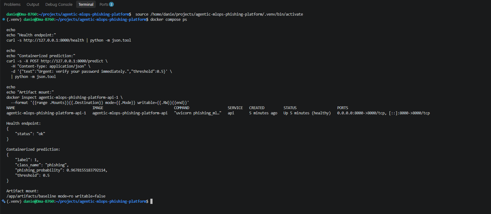

## Tech Stack


**Backend:** Python, FastAPI and REST APIs  
**ML & Experiment Tracking:** PyTorch and MLflow  
**Quality & Delivery:** pytest, Docker and GitHub Actions

# Agentic MLOps Phishing Platform

A production-style MLOps platform for phishing and incident detection.

## Goals

- Train and evaluate phishing detection models with PyTorch.
- Track experiments with MLflow.
- Serve predictions through a FastAPI inference service.
- Containerize the system with Docker.
- Deploy training and inference workloads on Kubernetes.
- Add an agentic AI assistant to analyze model metrics, logs, and regressions.
- Extend the platform to distributed training with Ray and cloud infrastructure on AWS.

## Architecture

The implemented architecture connects reproducible model training and MLflow
traceability to a quality gate, containerized inference, local RAG, and a
LangGraph incident workflow with an explicit human-approval boundary.

[](docs/assets/portfolio/platform-architecture.png)

The editable diagram source is available in [Mermaid format](docs/assets/portfolio/platform-architecture.mmd).

## Running Locally

Train the baseline model:

```bash
python -m phishing_ml.training.train_baseline
```

Run the API locally:

```bash
uvicorn phishing_ml.inference.api:app --reload
```

Test the API:

```bash
curl http://127.0.0.1:8000/health
```

```bash
curl -X POST "http://127.0.0.1:8000/predict" \
  -H "Content-Type: application/json" \
  -d '{"text":"Security alert: validate your credentials within 24 hours."}'
```

## Using the Deterministic MLOps Copilot

The current copilot stage works without an LLM. It exposes deterministic,
testable tools for inspecting model quality, classifying suspicious messages,
retrieving cited evidence, and orchestrating quality-gated incident analysis.

Check the model quality status:

```bash
python -m phishing_ml.agents.copilot status
```

Classify a message:

```bash
python -m phishing_ml.agents.copilot classify \
  "Urgent: verify your password immediately."
```

Search the local project knowledge base:

```bash
python -m phishing_ml.agents.copilot search \
  "How is model quality validated?" \
  --limit 3
```

Analyze a suspicious message through the LangGraph incident workflow:

```bash
python -m phishing_ml.agents.copilot analyze \
  "Urgent: verify your password immediately." \
  --output summary
```

Use `--output summary` for a concise human-readable result. Omit the option to
retain the complete structured JSON response.

The local retrieval pipeline loads trusted project documentation,
configuration, reports, and CI workflows; creates overlapping line-based
chunks; ranks them with TF-IDF cosine similarity; and returns source citations.

The `analyze` command checks the model quality gate before inference. Approved
models can classify messages, while phishing predictions trigger retrieval of
cited incident-response guidance. Privileged containment actions remain under
explicit human control.

## Running With Docker Compose

Build and run the inference API:

```bash
docker compose up --build api
```

The API expects model artifacts at:

```text
artifacts/baseline/model.pt
artifacts/baseline/vectorizer.pkl
```

## Portfolio Evidence

The screenshots below show the implemented workflows running end to end.
Select any image to open the full-resolution version.

<table>
  <tr>
    <td width="50%" valign="top">
      <a href="docs/assets/portfolio/github-actions-secure-mlops-ci.png">
        
      </a>
      <br>
      <strong>Secure CI/CD</strong><br>
      Dependency audit, model training, evaluation, quality gate, static
      analysis, tests, and Docker Compose validation.
    </td>
    <td width="50%" valign="top">
      <a href="docs/assets/portfolio/langgraph-phishing-incident-analysis.png">
        
      </a>
      <br>
      <strong>Quality-gated incident analysis</strong><br>
      Phishing classification, quality metrics, cited RAG guidance, and an
      explicit human-approval boundary.
    </td>
  </tr>
  <tr>
    <td width="50%" valign="top">
      <a href="docs/assets/portfolio/mlflow-run-metrics.png">
        
      </a>
      <br>
      <strong>Experiment traceability</strong><br>
      Reproducible training parameters and model metrics recorded in MLflow.
    </td>
    <td width="50%" valign="top">
      <a href="docs/assets/portfolio/mlflow-model-artifacts.png">
        
      </a>
      <br>
      <strong>Reproducible artifacts</strong><br>
      Versioned configuration, PyTorch model, and fitted TF-IDF vectorizer.
    </td>
  </tr>
  <tr>
    <td width="50%" valign="top" align="center">
      <a href="docs/assets/portfolio/fastapi-phishing-prediction.png">
        
      </a>
      <br>
      <strong>FastAPI prediction contract</strong><br>
      Typed request payload and structured phishing response through
      <code>POST /predict</code>.
    </td>
    <td width="50%" valign="top">
      <a href="docs/assets/portfolio/docker-compose-healthy-api.png">
        
      </a>
      <br>
      <strong>Containerized inference</strong><br>
      Healthy API, live prediction, and model artifacts mounted read-only.
    </td>
  </tr>
</table>

## Roadmap

- [x] Project scaffold
- [x] Synthetic phishing dataset
- [x] Training pipeline
- [x] Evaluation pipeline
- [x] FastAPI inference service
- [x] MLflow experiment tracking
- [x] Config-driven training and MLflow traceability
- [x] Automated tests and GitHub Actions CI
- [x] Structured evaluation report and model quality gate
- [x] Docker Compose local environment
- [x] Deterministic MLOps Copilot tools and CLI
- [x] Local RAG knowledge base
- [x] LangGraph agentic copilot
- [ ] Full-stack generative AI interface
- [ ] MCP tool server
- [ ] Kubernetes manifests
- [ ] Ray distributed training
- [ ] AWS deployment
